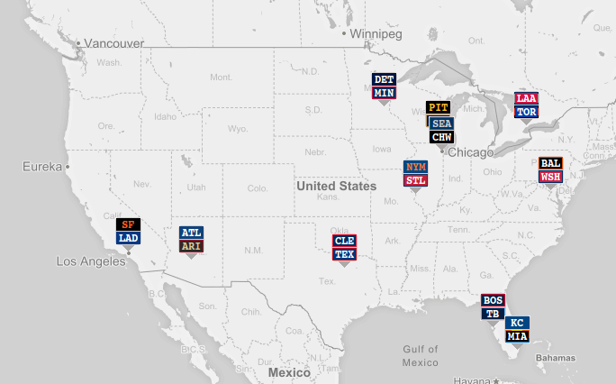

# GamesMapMLB

Have you ever wanted to see the day’s baseball games ON A MAP!!?

No? Well, if you ever change your mind, [have I got a map for you!](https://maputopia.com/mlb-map/)

This is the API repo.  For the client repo, see: [Github Client Repo](https://github.com/royhobbstn/mlb-map).

[Ballpark data](https://github.com/cageyjames/GeoJSON-Ballparks) available courtesy of James Fee.

Full writeup at my blog on https://maputopia.com/2016/06/baseball-and-raspberry-pi/